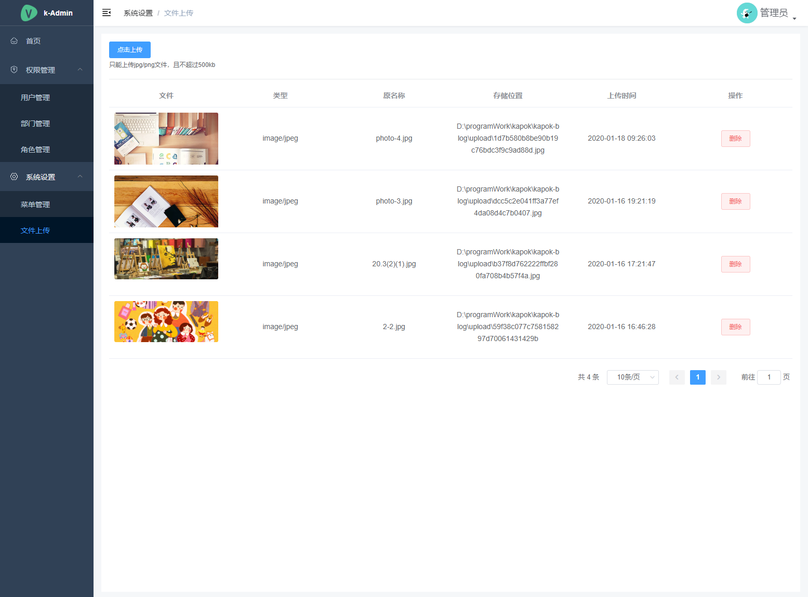

<div align="center">
<br/>
<br/>
  <h1 algin="center">
    Nest Admin
  </h1>
</div>

<p align="center">
  <a href="#">
    
  </a>
  <a href="#">
    
  </a>
  <a href="#">
    
  </a>
</p>

#### 项目说明
```Nest Admin``` 管理系统，是基于 ```Nestjs```，```Vue``` 打造出的一站式 RBAC 管理平台。

核心模块包括： 用户、角色、菜单、日志、文件管理等功能。


#### 本地部署
1. 通过 git 下载源码
2. 执行 db/kapok.sql 文件，初始化数据
3. 修改 config/dev.yml 文件， 更改 mysql 账号和密码，库
4. 本地开启了 nestjs 静态服务，作为图片服务器，默认上传到总项目根目录 upload 目录,
5. 分别在 client servers 目录下，执行 npm i （servers npm i 安装不成功， 请使用 pnpm）
6. 安装完依赖，servers 目录下执行 npm run start:dev； client 目录下执行 npm run serve 即可启动项目
7. 浏览器访问 http://localhost:9540 即可打开页面， swagger 文档地址 http://localhost:8081/api/docs
8. 可测试的账号密码： admin/admin


#### 效果图





如果你觉得这个项目帮助到了你，你可以帮作者买一杯果汁表示鼓励


